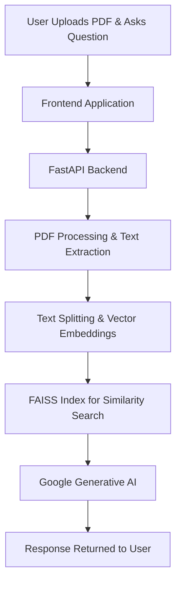

<!-- # Project README

## Project Setup

Follow these steps to set up the project.

1. **Install Dependencies:**

   ```py
   pip install -r requirements.txt
   ```

2. **Create env file:**
   Generate google gemini api key

   ```py
   GOOGLE_API_KEY=
   ```

3. **Run the Server:**
   ```py
   uvicorn app.main:app --reload
   ```

# Frontend Repository Link:

    https://github.com/Impachouri/ChatBot-Frontend -->

# PDF Bot: Chat-Based PDF Question Answering

[](https://github.com/Impachouri/pdfbot-backend/issues)
[](https://github.com/Impachouri/pdfbot-backend/stargazers)
[](LICENSE)

PDF Bot is an interactive chatbot application that allows users to upload PDF documents and ask detailed questions about their content. It comprises two components:

- **Frontend**: Provides the user interface for uploading PDFs and interacting with the chatbot.  
  GitHub: [ChatBot-Frontend](https://github.com/Impachouri/ChatBot-Frontend)
- **Backend**: A FastAPI service for processing PDFs, extracting text, generating vector embeddings using Google Generative AI, and powering the chatbot responses.  
  GitHub: [pdfbot-backend](https://github.com/Impachouri/pdfbot-backend)

---

## Table of Contents

- [Overview](#overview)
- [Architecture](#architecture)
- [Features](#features)
- [Setup & Installation](#setup--installation)
  - [Frontend Setup](#frontend-setup)
  - [Backend Setup](#backend-setup)
- [Interactive Demo](#interactive-demo)
- [Contributing](#contributing)
- [License](#license)

---

## Overview

PDF Bot helps users quickly find answers in large PDF documents. The application:

- Processes uploaded PDFs.
- Extracts and splits text into manageable chunks.
- Generates vector embeddings for fast text similarity search.
- Uses a conversational AI powered by Google Generative AI to answer user questions.

---

## Architecture



---

## Features

- **PDF Upload & Processing:** Seamlessly upload PDFs to extract content.
- **Efficient Text Retrieval:** Splits text and creates vector embeddings stored in a FAISS index.
- **Conversational AI:** Answers questions based on document content using Google Generative AI.
- **Interactive UI:** Easy-to-use frontend that communicates with the FastAPI backend.
- **Database Integration:** Stores document metadata and session tokens for persistence.

---

## Setup & Installation

### Frontend Setup

1. **Clone the Repository:**

   ```bash
   git clone https://github.com/Impachouri/ChatBot-Frontend.git
   cd ChatBot-Frontend
   ```

2. **Install Dependencies:**

   ```bash
   npm install
   ```

3. **Configure Environment Variables:**

   ```env
   REACT_APP_API_URL=http://localhost:8000
   ```

4. **Run the Frontend:**

   ```bash
   npm start
   ```

5. **Access the App:**
   Open [http://localhost:3000](http://localhost:3000).

---

### Backend Setup

1. **Clone the Repository:**

   ```bash
   git clone https://github.com/Impachouri/pdfbot-backend.git
   cd pdfbot-backend
   ```

2. **Create & Activate a Virtual Environment:**

   ```bash
   python3 -m venv venv
   source venv/bin/activate  # On Windows use: venv\Scripts\activate
   ```

3. **Install Dependencies:**

   ```bash
   pip install -r requirements.txt
   ```

4. **Configure Environment Variables:**

   ```env
   GOOGLE_API_KEY=your_google_api_key
   DATABASE_URL=your_database_connection_string
   ```

5. **Run the FastAPI Server:**

   ```bash
   uvicorn main:app --reload
   ```

6. **API Documentation:**
   Visit [http://127.0.0.1:8000/docs](http://127.0.0.1:8000/docs).

---

## Interactive Demo

Try out the PDF Bot interactively:

- **Upload a PDF:** Use the frontend interface to upload your PDF document.
- **Ask a Question:** Type your question about the document content.
- **View the Answer:** The backend processes your query and returns a detailed response powered by Google Generative AI.

---

## Contributing

We welcome contributions!

1. Fork the repositories.
2. Create a feature branch.
3. Commit your changes.
4. Submit a pull request.

For major changes, please open an issue first.

---

## License

This project is licensed under the [MIT License](LICENSE).

---
